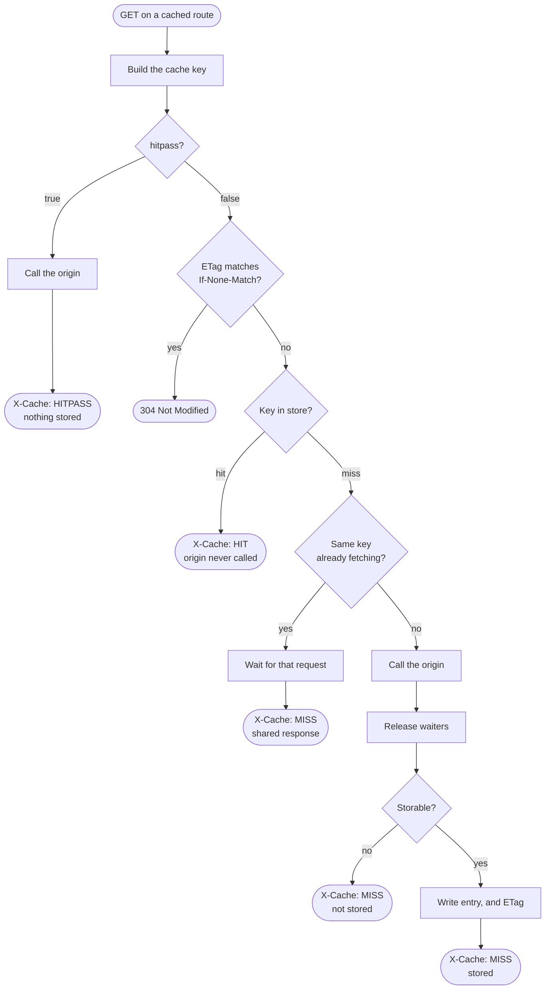
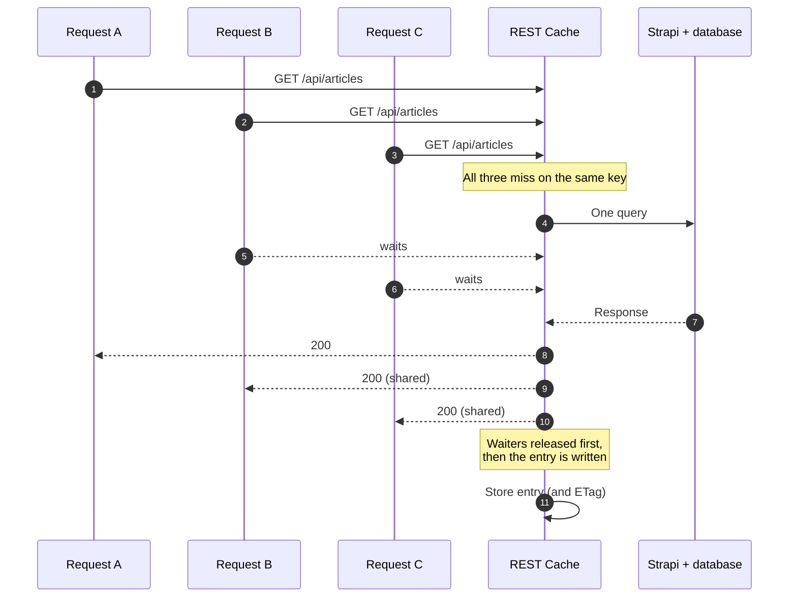
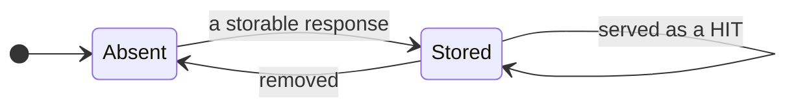

# {{ $frontmatter.title }}

The plugin caches `GET` responses from Strapi's REST API. It caches nothing
until you name the content types you want cached, and it only touches the
routes it was told about: the cache middleware is injected onto matching routes
at register time, so a route you did not configure carries no overhead at all.

Two things have to be true for a response to be served from cache:

1. the request matched a route the plugin registered — a content type's
   [default routes](./content-types.md) or a [route you listed](./custom-routes.md);
2. the request was not bypassed by [`hitpass`](#hitpass), and the stored
   response is still within its `maxAge`.

Everything else — deciding what a request is *the same as*, throwing entries
away when content changes — is covered in [Cache keys](./keys.md) and
[Invalidation](../invalidation/index.md).

If the plugin is not installed yet, start with
[Getting started](../getting-started.md).

## The read path

For every request on a cached route, in this order:

1. **Build the cache key.** From the request path, the query string, any
   configured headers, and (optionally) the caller's identity. See
   [Cache keys](./keys.md).
2. **Run `hitpass`.** If it returns true the cache is skipped entirely: nothing
   is read, and whatever the origin returns is *not* stored.
3. **Check the ETag**, if `enableEtag` is on. A stored ETag matching the
   request's `If-None-Match` ends the request with `304 Not Modified` and no
   body.
4. **Look the key up.** A hit is returned immediately with status `200`, along
   with the stored ETag when there is one.
5. **On a miss, check for an in-flight request** for the same key. If one
   exists, wait for it instead of calling the origin again. See
   [Request coalescing](#request-coalescing).
6. **Call the origin** — the Strapi controller, and every middleware between it
   and the cache.
7. **Hand the response to anything waiting**, then decide whether it
   [can be stored](#what-is-never-stored), and write it.



The write is awaited before the request finishes rather than fired and
forgotten. An unawaited write outlives its request, so a purge triggered by a
concurrent write could complete first and then be undone by the late write
landing afterwards — repopulating the cache with data read *before* the change,
which would then survive until `maxAge`.
([#132](https://github.com/strapi-community/plugin-rest-cache/issues/132))

### Seeing which path a request took

Turn on `enableXCacheHeaders` and every response on a cached route carries an
`X-Cache` header:

| Value | Meaning |
| --- | --- |
| `HIT` | Served from the cache. The origin was not called. |
| `MISS` | The origin was called and the response was (usually) stored. |
| `HITPASS` | `hitpass` returned true. The cache was neither read nor written. |

It is off by default because it is diagnostic output, not something you
necessarily want on a public response. Turn it on while configuring the plugin,
and leave it on if a CDN or reverse proxy in front of Strapi makes it useful.

For more detail, `debug: true` (or `DEBUG=strapi:plugin-rest-cache`) logs the
key and the outcome of every lookup, plus every route the plugin registered at
boot.

## Configuration

:::: code-group

```js [JavaScript]
// file: ./config/plugins.js

module.exports = {
  "rest-cache": {
    config: {
      provider: {
        name: "memory",
      },
      strategy: {
        // Milliseconds. This is one hour.
        maxAge: 3600000,
        enableXCacheHeaders: true,
        contentTypes: ["api::article.article"],
      },
    },
  },
};
```

```ts [TypeScript]
// file: ./config/plugins.ts

export default {
  "rest-cache": {
    config: {
      provider: {
        name: "memory",
      },
      strategy: {
        // Milliseconds. This is one hour.
        maxAge: 3600000,
        enableXCacheHeaders: true,
        contentTypes: ["api::article.article"],
      },
    },
  },
};
```

::::

Every option is listed in the [configuration reference](../reference/config.md).

::: warning Durations are milliseconds
`maxAge` is milliseconds, everywhere, without exception. `3600000` is one hour;
`60000` is one minute.

Worth stating loudly because getting it wrong is silent. The providers once
multiplied an already-millisecond `maxAge` by 1000 before handing it to the
store, so a configured hour lived 41.7 days and nothing ever expired.
([#126](https://github.com/strapi-community/plugin-rest-cache/issues/126))
:::

`maxAge` can be set at three levels, each inheriting from the one above:
`strategy` → content type → route. A route that overrides it wins.

## hitpass

`hitpass` decides, per request, whether to bypass the cache entirely. It is a
function receiving the Koa context and returning a boolean (or a promise of
one); a plain boolean works too.

The shipped default bypasses any request carrying an `authorization` or a
`cookie` header:

```js
hitpass: (ctx) =>
  Boolean(ctx.request.headers.authorization || ctx.request.headers.cookie);
```

That is the conservative choice, and it is the reason the plugin is safe to
switch on without thinking hard: authenticated and session-bearing traffic is
never accelerated, but it is also never shared between callers. A response
produced for one logged-in user cannot be handed to another, because it was
never stored.

If you want authenticated traffic cached, turn `hitpass` off and key entries on
the caller with [`keys.useAuth`](./keys.md#useauth). Doing the first without the
second means two callers authorised for the same route share one entry, and
whoever misses first decides what everyone else sees. The server logs a warning
at boot if it finds that combination.

Like `maxAge`, `hitpass` can be set on the strategy, on a content type, or on a
single route.

## What is never stored

<Badge type="tip" text="since 5.1.0" />

Independently of your configuration, the plugin refuses to store a response
when any of these hold. Caching captures the response body and replays it to a
different caller later, which quietly assumes the body is a plain serialisable
value and that the response is not specific to whoever triggered it. Neither
holds for every response.
([#133](https://github.com/strapi-community/plugin-rest-cache/issues/133))

| Condition | Why |
| --- | --- |
| The handler set `ctx.respond = false` | It took over the socket and wrote the response itself, so the body is not the response. Strapi's own `/mcp` route does this. |
| The body is empty | There is nothing to replay. |
| The status is not `2xx` | Errors and redirects are not the answer to the question that was asked. |
| The body is a stream | A stream can be consumed once. A stored copy cannot be replayed, and the entry would poison every later request for that key. |
| The response sets `Set-Cookie` | A cookie is issued to one caller. Replaying it hands that caller's session, CSRF token or consent state to everybody sharing the key. |
| `Cache-Control` says `no-store` or `private` | An explicit instruction from the handler not to store the response. |

The response is still returned to the client as normal — only the storing step
is skipped. With `debug` on, the log line for the request states which of these
applied.

## Request coalescing

<Badge type="tip" text="since 5.1.0" />

When several requests for the same uncached key arrive at once, exactly one
calls the origin. The rest wait on it and are served its result.

Without this, N concurrent misses produce N origin queries — the thundering
herd a cache exists to prevent. It fires exactly when it hurts most: on a cold
start, immediately after a purge, and at `maxAge` expiry, which is to say at
the moments the database is least able to absorb it.
([#130](https://github.com/strapi-community/plugin-rest-cache/issues/130))



Two details worth knowing:

- **A failure is not shared.** If the leading request fails, the waiters do not
  inherit its failure; they fall through and fetch independently.
- **Waiters are released before the write.** The leader hands its response to
  the waiters first and writes to the store afterwards, so a slow store does
  not hold anyone up.

Coalescing is keyed on the cache key, so it only ever merges requests that
would have shared an entry anyway.

## When the store is slow

A cache read is bounded by `provider.getTimeout` (500ms by default). If the
provider does not answer within it, the read is abandoned and treated as a
miss. A degraded store therefore costs you a cache, not a site.

Writes are best-effort in the same spirit: a provider error while storing a
response is logged and the response is still returned.

## The life of an entry



An entry has exactly two states, and only one of the transitions is
interesting: what takes it out of the cache again.

| Removed by | When |
| --- | --- |
| **Invalidation** | Content it depends on was written. This is the usual one. |
| **`maxAge`** | The lifetime elapsed without anything writing. |
| **A manual purge** | From the [admin panel](../admin/index.md), the API, or a service call. |
| **Eviction** | The memory provider reached `maxSize` and dropped the least recently used entry. Redis-backed caches evict per your Redis `maxmemory-policy`. |

A response that is never stored in the first place — bypassed by `hitpass`, or
[refused as unstorable](#what-is-never-stored) — simply leaves the entry
`Absent`; it is not a state of its own.

An entry is only ever one write away from removal, which is what makes a long
`maxAge` safe. It is an upper bound on staleness for changes nothing observed,
not a promise to serve stale content for that long.

## Where entries live

Nothing here says *where* the bytes are kept — that is the
[provider's](../providers/index.md) job. The memory provider keeps them in the
Strapi process; the redis provider keeps them in Redis, which is what you want
as soon as you run more than one instance, since each memory-backed instance
caches and invalidates only its own copy.

`keysPrefix` prefixes every stored key, so the cache can share a keyspace with
other consumers. If your Redis client is already configured with a `keyPrefix`,
match it here.

## Next

- [Caching a content type](./content-types.md) — the default routes.
- [Caching custom routes](./custom-routes.md) — anything else.
- [Cache keys](./keys.md) — what makes two requests "the same".
- [Invalidation](../invalidation/index.md) — how entries are thrown away.
