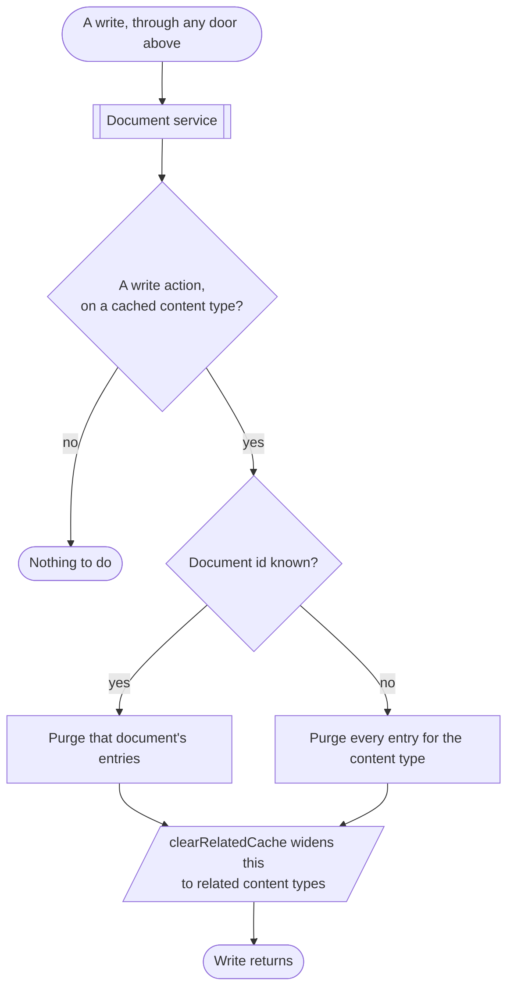
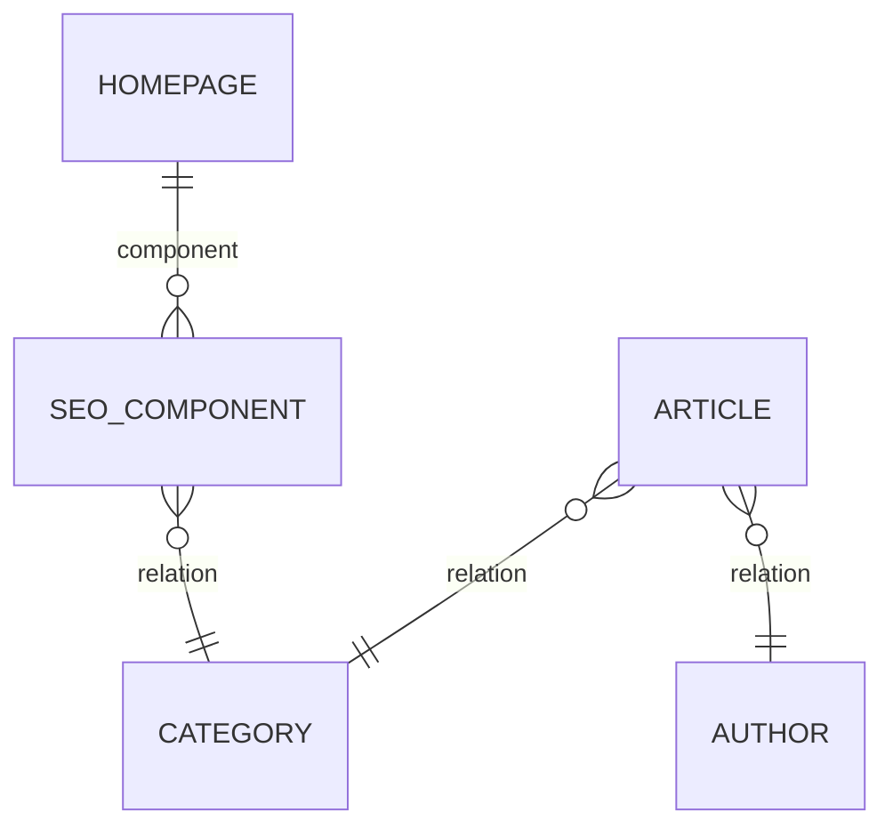

# {{ $frontmatter.title }}

A cached response is a copy of something that can change. Invalidation is how
the plugin throws that copy away when it does — automatically, for every write,
without you writing any code.

::: tip Since 5.1.0
Invalidation hooks Strapi's **document service** rather than HTTP routes. This
is `strategy.enableDocumentServiceMiddleware`, on by default.
([#129](https://github.com/strapi-community/plugin-rest-cache/issues/129))
:::

## What triggers a purge

Every write in Strapi 5 funnels through the document service, whichever door it
came in by. Hooking there means all of these invalidate the cache:

- REST API writes;
- GraphQL mutations;
- the admin panel's content manager, including bulk actions, clone, publish,
  unpublish and discard;
- the deprecated entity service;
- scheduled **Content Releases** — content that publishes itself at 3am with no
  request involved;
- review workflow transitions;
- any `strapi.documents(...)` call of your own: a service, a cron job, a
  webhook handler, a migration.

The route-based approach this replaced could only see writes that arrived on a
route it had been told about. It had to carry a hardcoded list of Strapi's
content-manager routes, which drifts every time Strapi adds one, and it was
structurally blind to everything in the second half of that list.



The first box is the point. A route-based approach can only sit in front of the
REST API; every other door in that list changes content without the cache
noticing.

### The actions that count as writes

`create`, `clone`, `update`, `delete`, `publish`, `unpublish`, `discardDraft`.

The middleware runs for reads too — `findMany`, `findOne`, `count` — so
filtering to writes is not an optimisation. Without it, populating a cache
entry would immediately invalidate it.

### Scope of each purge

The purge is scoped to the document that was written when the plugin can
identify it:

| Action | Document id | Purge |
| --- | --- | --- |
| `create`, `clone` | Minted by the write, read from the **result** | Targeted at the new document |
| `update`, `delete`, `publish`, `unpublish`, `discardDraft` | Carried on the **params** | Targeted at that document |
| Anything with no resolvable document id | — | Wildcard: every entry for the content type |

Splitting those two cases is deliberate: `create` and `clone` mint an id that
does not exist until the write returns, so reading it from the params — as
every other action requires — would silently produce an unscoped purge on every
create.

A targeted purge matches the content type's collection route and any route
whose parameters it can fill in. See
[route parameters and purging](../caching/custom-routes.md#route-parameters-and-purging)
for the case where it cannot.

Content types that are not in your configuration are ignored entirely — the
middleware checks before doing any work, so writes to uncached content types
cost nothing.

## Related content types

`clearRelatedCache` (default `true`) widens each purge to the content types
related to the one that changed.

The relation set is derived from your schemas at boot: everything reachable
through **relations** and through **components**, following components into
their own attributes until nothing new is found. If an article embeds a
component that relates to a category, purging the category also purges the
article's cached responses — because that response contains category data and
is now wrong.

Related content types are purged wildcard-style, since there is no way to know
which of their entries embedded the changed document.

Given a fairly ordinary blog schema:



Writing to `CATEGORY` purges `CATEGORY`, and also `ARTICLE` — whose responses
embed it — and `HOMEPAGE`, which reaches it through a component two steps away.
The traversal runs to a fixed point, so depth is not a limit.

::: info This is why purges look wider than the write
A content type is a member of its own related set, so with `clearRelatedCache`
on, a targeted write also issues a wildcard purge for the content type itself.
That is what clears parameterised custom routes like `/api/categories/slug/:slug`
on an ordinary update.

Turning `clearRelatedCache` off makes purges precise and makes those routes
survive until `maxAge`. Precision here buys a lower miss rate at the cost of
occasional stale responses; the default chooses correctness.
:::

## Timing and failure

The purge is **awaited before the write returns**, so a client that writes and
immediately reads sees fresh content.

It is deliberately not deferred to the database transaction's commit callbacks.
Strapi runs those with `forEach` and never awaits them, so an async purge
registered that way is fire-and-forget and races the write that triggered it —
reliably lost on the Redis provider, where a purge is a `SCAN` plus a round
trip.

The trade-off is visible in one place: content manager bulk operations wrap
their loop in a transaction, so the purge lands before that outer commit. A
read arriving in that window can repopulate the cache from pre-commit state.
That race pre-dates this design and applies equally to the route middleware it
replaced.
([#132](https://github.com/strapi-community/plugin-rest-cache/issues/132))

**A failed purge never fails the write.** If the provider is down or errors,
the error is logged and the write completes. The cost is a stale entry until
`maxAge`; the alternative — refusing writes because a cache is unwell — is
worse.

## What invalidation cannot see

- **Writes that bypass the document service**, such as `strapi.db.query(...)`
  or raw SQL. Nothing observes those.
- **Changes made outside this Strapi process**: another service writing to the
  same database, a restore from backup, a manual edit.
- **Other instances, when using the memory provider.** Each instance caches and
  invalidates only its own copy, so a write handled by instance A leaves
  instance B serving stale responses until they expire. Use the
  [redis provider](../providers/index.md) if you run more than one instance.

For those cases, purge explicitly — see [Purging](./purging.md).

`maxAge` is the backstop under all of them. However invalidation is configured,
nothing outlives it.

::: info Deleting a role empties the cache
Deleting a users-permissions role resets the entire cache. Permissions decide
what a response contains, and there is no way to work out which entries a
removed role affected.
:::

## The legacy route-based mode

Setting `enableDocumentServiceMiddleware: false` falls back to the previous
behaviour: purge middlewares injected onto the non-`GET` routes of your cached
content types, plus — when `enableAdminCTBMiddleware` is on — onto a hardcoded
list of content-manager routes.

The two modes are mutually exclusive. Running both would purge twice for every
routed write, so while the document service middleware is on, the route
injection is skipped and `enableAdminCTBMiddleware` has no effect.

The fallback exists so that an upgrade has an escape hatch, not because it is
equivalent. It cannot see GraphQL mutations, Content Releases, or any write
that does not traverse a route it knows about.

:::: code-group

```js [JavaScript]
// file: ./config/plugins.js

module.exports = {
  "rest-cache": {
    config: {
      strategy: {
        // Only if you have a specific reason. The default is `true`.
        enableDocumentServiceMiddleware: false,
        enableAdminCTBMiddleware: true,
        contentTypes: ["api::article.article"],
      },
    },
  },
};
```

```ts [TypeScript]
// file: ./config/plugins.ts

export default {
  "rest-cache": {
    config: {
      strategy: {
        // Only if you have a specific reason. The default is `true`.
        enableDocumentServiceMiddleware: false,
        enableAdminCTBMiddleware: true,
        contentTypes: ["api::article.article"],
      },
    },
  },
};
```

::::

## Watching it happen

With `debug: true`, every purge is logged with the action, the content type and
the scope:

```
[PURGE] update api::article.article documentId=lxr8ai1cs0a1234
[PURGE] delete api::article.article (wildcard)
[PURGING]: 14 key(s)
```

If a write does not produce one of these lines, either the content type is not
in your configuration, or the write did not go through the document service.

## Next

- [Purging manually](./purging.md) — admin UI, HTTP endpoints, services.
- [How caching works](../caching/index.md) — the other half of the loop.
- [Admin panel](../admin/index.md) — where purge controls appear.
